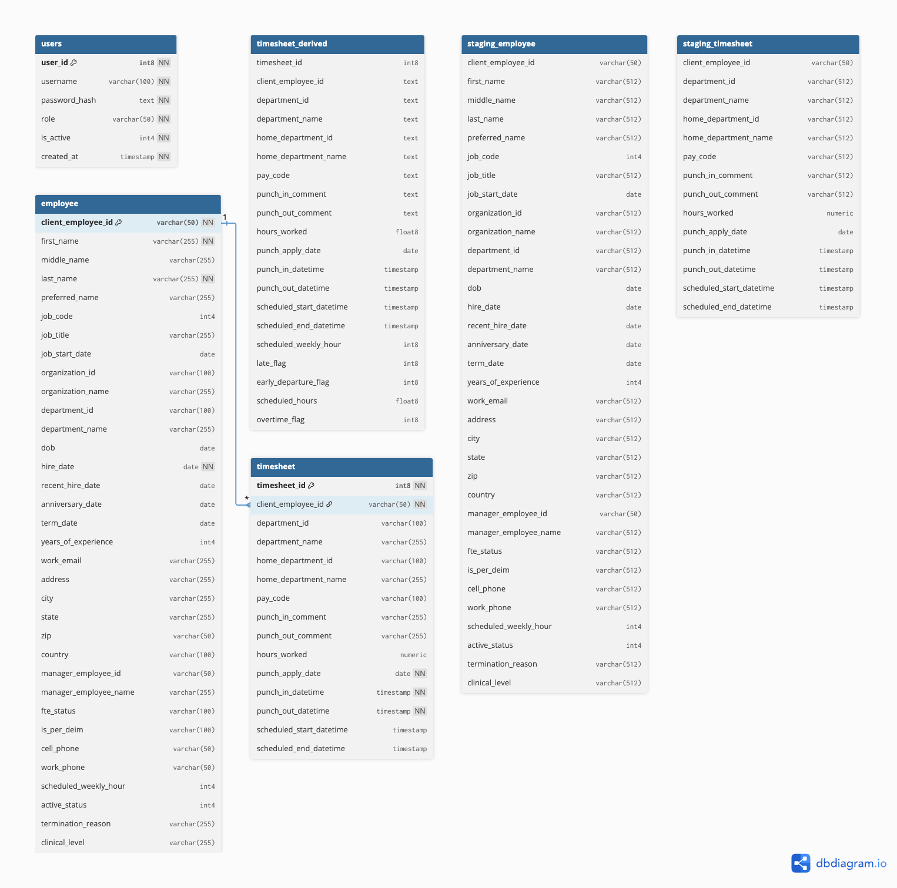

# ETL to Insights - Project Documentation

## Overview

This project implements an HR analytics data platform using a medallion-style ETL pipeline and a secured REST API.

- **Data pipeline goal:** ingest employee and timesheet data, standardize quality, and publish analytics-ready datasets.
- **Serving goal:** expose operational data through authenticated APIs with role-based access control.
- **Output goal:** generate KPI CSV outputs and interactive HTML reports for business stakeholders.

---

## 1) Engineering Decisions

### 1.1 Technology Choices

- **Python** as the primary language for ETL and API development for consistent implementation and strong data ecosystem support.
- **PostgreSQL** as the analytical and operational store because it supports relational integrity, indexing, and SQL-native analytics.
- **Apache Airflow** for orchestration of medallion ETL stages, retry logic, and operational visibility.
- **Pandas + SQLAlchemy** for transformation logic and table loading with chunked processing.
- **FastAPI** for REST API implementation due to strong typing, OpenAPI docs, and fast development velocity.
- **JWT (PyJWT)** for stateless authentication and role-aware authorization.
- **Docker Compose** for consistent local deployment of Airflow + PostgreSQL.

### 1.2 Architecture Decisions

- **Medallion pattern (Bronze/Silver/Gold):**
  - **Bronze:** raw ingestion into `staging_employee`, `staging_timesheet`.
  - **Silver:** cleaned relational tables `employee`, `timesheet`.
  - **Gold:** derived analytics table `timesheet_derived` with attendance behavior flags.
- **Separation of concerns:**
  - `src/etl/*` for ingestion/transformation/derivation.
  - `src/analytics/visualizations.py` for KPI extraction and report generation.
  - `api/*` for auth, authorization, and data-serving endpoints.
- **Security model:**
  - `users` table stores credentials as salted PBKDF2 hashes.
  - JWT carries `sub` (username) and `role` claims.
  - Role policy: `admin` can mutate employee/user data, `viewer` has read access.

### 1.3 Trade-offs and Rationale

- **Pandas-driven transforms vs pure SQL transforms**
  - Chosen for readability and flexible type-cleaning.
  - Trade-off: higher memory overhead than pure SQL-based pipelines.
- **Batch truncate-and-reload for Silver tables**
  - Simplifies data consistency and idempotent reruns.
  - Trade-off: not optimized for low-latency incremental CDC updates.
- **Stateless JWT auth**
  - Easy horizontal scaling and low session-management complexity.
  - Trade-off: token revocation is indirect (handled through user status/role checks and token expiry).
- **Role model (`admin`, `viewer`)**
  - Keeps permissions explicit and easy to audit.
  - Trade-off: coarse-grained for large enterprises (no fine-grained row-level policies yet).

---

## 2) Setup Instructions (Step-by-Step)

### 2.1 Prerequisites

- Python 3.10+
- Docker + Docker Compose
- Git

### 2.2 Clone and Prepare

```bash
git clone <your-repo-url>
cd ETL_to_Insights
```

### 2.3 Configure Environment

Create or update `.env` with these keys (values should match your environment):

```env
POSTGRES_HOST=localhost
POSTGRES_PORT=5432
POSTGRES_USER=postgres
POSTGRES_PASSWORD=postgres
ETL_POSTGRES_DB=etl_db
POSTGRES_DB=airflow_metadata

AIRFLOW_FERNET_KEY=<fernet_key>
AIRFLOW_ADMIN_PASSWORD=<airflow_admin_password>

SOURCE_TYPE=local
EMPLOYEE_CSV=data/employee_202510161125.csv
TIMESHEETS_FOLDER=data/timesheets

# Optional for MinIO source mode
MINIO_ENDPOINT=
MINIO_ACCESS_KEY=
MINIO_SECRET_KEY=
MINIO_BUCKET=
MINIO_EMPLOYEE_OBJECT=
MINIO_TIMESHEETS_PREFIX=

# API auth settings
JWT_SECRET_KEY=<strong_secret>
JWT_EXPIRES_MINUTES=60
```

Notes:
- `POSTGRES_DB` is for Airflow metadata DB.
- `ETL_POSTGRES_DB` is for ETL domain data (`employee`, `timesheet`, etc.).
- If they are different names, create `ETL_POSTGRES_DB` before running migrations.
- Use a long random value for `JWT_SECRET_KEY` in non-local environments.

Create ETL DB (only required when it does not already exist):

```bash
docker exec -it etl-postgres psql -U "$POSTGRES_USER" -d postgres -c "CREATE DATABASE etl_db;"
```

### 2.4 Install Python Dependencies

```bash
pip install -r requirements.txt
```

### 2.5 Start Infrastructure

```bash
docker compose up -d db airflow-init airflow-webserver airflow-scheduler
```

Validate services:

```bash
docker compose ps
```

### 2.6 Run Database Migrations

```bash
python src/migrate.py
```

This applies all files in `migrations/` including:
- core entities: `employee`, `timesheet`
- derived layer: `timesheet_derived`
- staging layer tables
- indexes
- API auth table: `users`

---

## 3) Usage Guide

### 3.1 Run the ETL Pipeline (Airflow)

1. Open Airflow UI at `http://localhost:8080`.
2. Login with the credentials configured for Airflow init.
3. Locate DAG: `etl_pipeline`.
4. Trigger a manual run.

Pipeline stages:
- `extract_employee` and `extract_timesheets` load Bronze data.
- `transform_employee` and `transform_timesheet` clean/load Silver data.
- `derive_gold` computes attendance behavior flags into Gold.

### 3.2 Run ETL Components Manually (Optional)

For local development/debugging, call modules directly from Python shell or scripts:
- `src/etl/extract_bronze.py`
- `src/etl/transform_silver.py`
- `src/etl/derived_gold.py`

### 3.3 Generate KPI Reports

Run:

```bash
python -m src.analytics.visualizations
```

Outputs:
- CSV KPI exports: `reports/csv/`
- Interactive chart HTML files: `reports/interactive/`
- Consolidated dashboard page: `reports/index.html`

### 3.4 Run the API

```bash
uvicorn api.main:app --reload --host 0.0.0.0 --port 8000
```

Open API docs:
- Swagger UI: `http://localhost:8000/docs`
- OpenAPI spec: `http://localhost:8000/openapi.json`

Authentication flow:
1. `POST /auth/bootstrap-admin` (one-time initial admin creation)
2. `POST /auth/login` to receive JWT token
3. Send `Authorization: Bearer <token>` to protected endpoints

---

## 4) Schema Documentation and Entity Relationships

### 4.1 Core Entities

- **`employee`** (dimension)
  - PK: `client_employee_id`
  - Stores identity, org hierarchy, tenure, and contact attributes.
- **`timesheet`** (fact)
  - PK: `timesheet_id`
  - FK: `client_employee_id -> employee.client_employee_id`
  - Stores worked hours, punch times, scheduling context.
- **`timesheet_derived`** (gold analytics)
  - Derived from `timesheet` (+ employee schedule context)
  - Adds `late_flag`, `early_departure_flag`, `overtime_flag`.
- **`users`** (API security)
  - PK: `user_id`
  - Unique: `username`
  - Contains password hash, role, active status.

### 4.2 Staging Entities

- `staging_employee`
- `staging_timesheet`

These are ingestion landing tables used before Silver-level cleaning and validation.

### 4.3 Relationship Model




### 4.4 Integrity and Performance Constraints

- FK on `timesheet.client_employee_id` enforces valid employee ownership.
- Indexes:
  - `idx_timesheet_employee` on `timesheet(client_employee_id)`
  - `idx_timesheet_date` on `timesheet(punch_apply_date)`
  - `idx_employee_department` on `employee(department_id)`
  - `idx_users_username` on `users(username)`

---

## 5) API Surface Summary

### Employee (CRUD)

- `POST /employees` (admin)
- `GET /employees` (authenticated)
- `GET /employees/{employee_id}` (authenticated)
- `PUT /employees/{employee_id}` (admin)
- `DELETE /employees/{employee_id}` (admin)

### Timesheet (Read-only)

- `GET /timesheets`
  - Optional filters: `employee_id`, `start_date`, `end_date`
- `GET /timesheets/employee/{employee_id}`
  - Optional filters: `start_date`, `end_date`

### Auth

- `POST /auth/bootstrap-admin`
- `POST /auth/register` (admin)
- `POST /auth/login`

---

## 6) Operational Notes

- Logs are available in `logs/` for Airflow tasks and scheduler behavior.
- Migrations run in lexical order from `migrations/`.
- Current pipeline is optimized for deterministic batch runs, not streaming ingestion.

---

